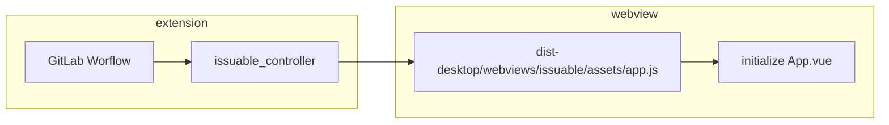
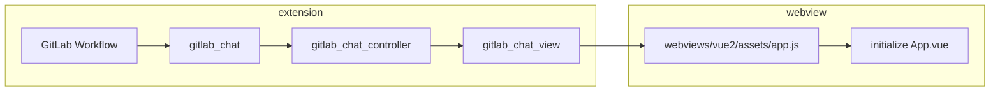

# Extension architecture

This document gives you a high-level overview of the main components of the extension. It helps you place your contribution in the right place in the codebase. This document describes the architecture as-is, but it also contains checkboxes for aspirations or refactoring in progress.

## What does the extension do?

The extension provides a "glue" layer between the [VS Code Extension API](https://code.visualstudio.com/api/references/vscode-api) and the GitLab instance API ([REST](https://docs.gitlab.com/api/api_resources/), [GraphQL](https://docs.gitlab.com/api/graphql/)). The extension code aims to connect VS Code editor with GitLab functionality as efficiently as possible. The less code and abstractions, the better.

## Environments

The Workflow extension runs in two different environments:

- Desktop: This extension works with the Desktop VS Code (or the VS Code Server). We publish the extension to two marketplaces ([Microsoft](https://marketplace.visualstudio.com/items?itemName=GitLab.gitlab-workflow) and [Eclipse](https://open-vsx.org/)).
  - This project builds the desktop build of the extension
- WebIDE: [WebIDE](https://gitlab.com/gitlab-org/gitlab-web-ide) is the GitLab clone of VS Code in a browser. We extend the VS Code functionality to work well with GitLab.
  - The WebIDE builds the browser version of the extension. WebIDE includes this repository as a dependency (Git submodule) and then builds the extension.

Based on these environments, the extension source code lives in three different folders:

- `src/common` contains the part of the extension that runs in both the browser and the desktop.
- `src/desktop` contains code that runs only in Desktop VS Code
- `src/browser` contains code that runs only in WebIDE

## `common` and the Platform

Because the WebIDE and Desktop environments are very different, we built abstraction over the way how get GitLab project data and how we make API calls:

```typescript
export interface GitLabPlatformForActiveProject {
  project: GitLabProject;

  fetchFromApi: fetchFromApi;
}
```

_(this abstraction will grow as we port more features)_

All code in `common` folder has to call either [VS Code API](https://code.visualstudio.com/api/references/vscode-api) that is available in Browser or the `GitLabPlatformForActiveProject`. The `common` code **must not** invoke any `browser` or `desktop` code or any Browser or Node.js APIs.

## `desktop`

This section describes code specific to the Workflow Desktop version. The key things to keep in mind are the desktop code:

- can fully integrate with Git
- can call any Node.js APIs
- can call arbitrary OS commands and create files on FS
- can open multiple projects from multiple GitLab instances at once
- can create multiple accounts even for the same instance

## `browser`

The primary goal of the content in the `browser` folder is to implement the `GitLabPlatform` in the browser. It uses mediator commands to communicate with the WebIDE. The folder's content also sets up telemetry for the browser environment.

It also contains some WebIDE-unrelated logic (like `crypto` or providing empty UserAgent headers) because the browser can't override them.

### The key concepts

- GitLab project is represented by a Git remote URL in the local repository.
- To access GitLab API, you need an access token for that instance.
- After you know the GitLab project URL and you have an access token, you can fetch the project from API.

These three points result in the most important interface in the whole extension:

```typescript
export interface ProjectInRepository {
  pointer: GitRemoteUrlPointer;
  account: Account;
  project: GitLabProject;
}
```

This interface is the only information we need for most extension commands and operations.

### Git integration

Our extension builds on the built-in [VS Code Git extension](https://github.com/microsoft/vscode/tree/main/extensions/git). Our extension listens on changes in the VS Code Git. Every time a repository is added or removed, we run extension initialization and try to find all GitLab projects in available repositories. Our extension is always in sync with the [VS Code version control view](https://code.visualstudio.com/docs/sourcecontrol/overview).

The main class interacting with the VS Code Git is [`GitExtensionWrapper`](../../src/desktop/git/git_extension_wrapper.ts). [`GitLabProjectRepository`](../../src/desktop/gitlab/gitlab_project_repository.ts) then listens on Git repository changes and initializes instances of `ProjectInRepository`.

### GitLab integration

We use [`gitlab_service.ts`](../../src/desktop/gitlab/gitlab_service.ts) for all calls to the GitLab API. We try to use predominantly [GraphQL](https://docs.gitlab.com/api/graphql/), but some features are not available in GraphQL, and then we use `cross-fetch` to connect to the [REST](https://docs.gitlab.com/api/api_resources/) API.

In most cases, the `GitLabService` is wrapped in `RefreshingGitLabService`, which checks that the OAuth token is valid before making an API call. If the token isn't valid, it refreshes the token.

When you want to obtain an instance of the `GitLabService`, use the `getGitLabService: (p: ProjectInRepository)` method.

> [!warning]
> The `gitlab_service.ts` is a large God-class and being phased out. Use this class's `fetchFromApi`
> method only. The preferred class is the `DefaultApiClient` that is shared across `browser/` and
> `desktop/` in `common/`. We will eventually replace references to `GitLabService.fetchFromApi`
> with direct references to `DefaultApiClient`.

## Deprecated patterns

### Singleton

The main method of injecting dependencies in the extension is using singletons:

```typescript
// singleton file
export const accountService: AccountService = new AccountService();
// dependent file
import { accountService } from './account_service';
await accountService.removeAccount(result.id);
```

The singleton approach has the advantage that the dependencies are always trivial to include.

The singleton approach has also many drawbacks:

- The dependency is not explicit - A module can use the `accountService` without requiring it during initialization/in the constructor.
- Singleton initialization
  - `init` method - Because the singletons are instantiated as soon as we start the application, we had to separate the instantiation from initialization. We have to call additional method (usually called `init()`) to provide the singletons with their dependencies.
  - Initialized before ready - the code is riddled with (`if (dependnecy is missing) throw new Error("not ready")`) style guards because the singletons are created before we can guarantee they are ready to work.

#### Solution: Explicit dependencies

The solution is to use explicit dependencies in the constructor. Once a sizable portion of the codebase uses

```typescript
class Dependency {
  constructor(as: AccountService) {}
  do() {
    this.#as.do();
  }
}
```

rather than

```typescript
import { accountService } from './account_service';

class Dependency {
  do() {
    accountService.do();
  }
}
```

Can introduce Dependency Injection the same way we [did in the GitLab Language Server](https://gitlab.com/gitlab-org/editor-extensions/gitlab-lsp/blob/5104542e59fdd44cd89a199351c4862ea9c392cf/src/common/api.ts#L119-135).

[This MR](https://gitlab.com/gitlab-org/gitlab-vscode-extension/-/merge_requests/1994/diffs#1b6a78948a1cb9ea7510eda6842a0c7c855aec96_21_22) is an example how we can _gradually_ remove the singleton implicit dependencies and replace them with explicit constructor dependencies.

## Building blocks of the extension

### Tree view (`src/desktop/tree_view`) (desktop-only)

[TreeView](https://code.visualstudio.com/api/extension-capabilities/extending-workbench#tree-view), is the left-hand-side panel where we show issues and merge requests. Every VS Code extension can contribute a TreeView.

### Commands (`src/<shared|desktop>/commands`)

[Commands](https://code.visualstudio.com/api/extension-guides/command) are functions that can be invoked either by the user (usually from [command palette](https://code.visualstudio.com/docs/getstarted/userinterface#_command-palette)) or programmatically. Example commands in this extension would be: **Insert Snippet**, **Refresh Sidebar**, and **Copy Link to Active File on GitLab**.

Commands are of two types:

- Commands that run on GitLab project (such as **Create Snippet**, **Open Current Project on GitLab**). These commands implement the [`ProjectCommand`](../../src/desktop/commands/run_with_valid_project.ts) interface.
- Commands that don't need a project (such as **Add Account to VS Code**, **Show Extension Logs**). These commands are functions with no arguments.

### Status bar (`src/desktop/status_bar.js`) (desktop-only)

The status bar is the last row at the bottom of the editor. We add multiple [Status Bar Items](https://code.visualstudio.com/api/extension-capabilities/extending-workbench#status-bar-item) to it to show pipeline status, open MR and closing Issue for the current branch.

We periodically check for changes (every 30 seconds). [`CurrentBranchRefresher`](../../src/desktop/current_branch_refresher.ts) is responsible for refreshing the information. [`StatusBar`](../../src/desktop/status_bar.ts) is then responsible for adding the items to the status bar.

### Webviews (`webviews/`)

[Webview](https://code.visualstudio.com/api/extension-guides/webview) is an API that allows extensions to show a custom web page in an editor tab or the side panel.

Currently, the extension hosts webviews of different complexity: from the simple [pendingjob](https://gitlab.com/gitlab-org/gitlab-vscode-extension/-/blob/4a6d73db6ec59e2a7c9f937f57382384994e85cd/webviews/pendingjob.html) residing in the root of `webviews/` to the more sophisticated Vue applications.

The Vue webviews reside in the `webviews/vue3` and `webviews/vue2` sub-folders. These folders are independent NPM packages with their own
`package.json` and [`vite`](https://vitejs.dev/guide/) configurations and are compiled into different dist folders. They don't
share dependencies with each other or with the main extension project. `webviews/vue3` uses Vue 3, `webviews/vue2` uses Vue 2.

Here are a couple of examples of the existing Vue webviews:

- `webviews/vue3/issuable` - Issuable. This webview shows merge requests and issue details in the side-panel.
- `webviews/vue2/gitlab_duo_chat` - GitLab Duo Chat. This webview integrates [the GitLab Duo Chat](https://docs.gitlab.com/development/ai_features/duo_chat/) into the extension.

#### Issuable Webview

We use Issuable Webview Panel to show merge request and issue details (`webviews/vue3/issuable`) in the editor's tab. `src/desktop/issuable_controller.js` is placed in the extension project, and initializes the issuable webview.



#### GitLab Duo Chat

GitLab Duo Chat is a `common` webview and should work the same in desktop VS Code and Web IDE. (Compare to Issuable, which is a `desktop` webview.) GitLab Duo Chat is rendered in the sidebar.



#### Create a new webview

##### Simple Webview

Use a simple webview when you need minimal user interaction. This is useful for showing user non-interactive information.

Copy the approach of the `pendingjob.html` webview:

- [controller](https://gitlab.com/gitlab-org/gitlab-vscode-extension/blob/7bbd570118c43dea80c045bd5cf02b84d24a6ed5/src/desktop/ci/pending_job_webview_controller.ts#L15)
- [webview](https://gitlab.com/gitlab-org/gitlab-vscode-extension/blob/7bbd570118c43dea80c045bd5cf02b84d24a6ed5/webviews/pendingjob.html#L1)

##### Vue webview

Use a Vue webview for interactive webviews. In interactive webviews users can, for example: add comments, toggle UI elements, and input text.

1. Create a new folder:
   - If you need `gitlab-ui` compatibility, create the folder in `webviews/vue2`.
   - If you don't need `gitlab-ui` compatibility, create the folder in `webviews/vue3`.
1. Copy `webviews/index-copy-this-into-a-new-webview-folder.html` as `index.html` into your webview folder's root. Adjust it to meet your needs. The file contains a best-practices boilerplate for `Content-Security-Policy`.
1. Structure the content in this folder as you see fit. If you create a Vue webview, you can extend the default vite configuration. Depending on your webview folder's location, it is in `webviews/vue3/vite.config.shared.js` or `webviews/vue2/vite.config.shared.js`.
1. Update `package.json` within the relevant `webviews/` sub-folder to include your new webview into the `watch` and `build` scripts. Your webview must be picked up when the whole extension is built.

If you build a Vue webview, copied `webviews/index-copy-this-into-a-new-webview-folder.html` as `index.html`, and extended the `vite.config.shared.js`, running `npm run build` in the relevant `webviews/` sub-folder should build your webview into the following structure in `dist/`:

```plaintext
- index.html
- assets
  - app.js
  - index.css
```

In this case, your extension will be automatically picked by the extension's build process while preparing all relevant webviews in `src/common/utils/webviews/prepare_webview_source.ts`.

To understand how the extension communicates with Webview, read the [Webview extension guide](https://code.visualstudio.com/api/extension-guides/webview).

### Accounts (`src/desktop/accounts/account_service.ts`) (desktop-only)

We authenticate to GitLab API using [personal access tokens](https://docs.gitlab.com/user/profile/personal_access_tokens/) or [OAuth](https://docs.gitlab.com/integration/oauth_provider/). The main interface is the [`Account`](../../src/common/platform/gitlab_account.ts) and we store them using the [`AccountService`](../../src/desktop/accounts/account_service.ts).

OAuth accounts are more complex than Token accounts. We create them using the [`GitLabAuthenticationProvider`](../../src/desktop/accounts/oauth/gitlab_authentication_provider.ts). Then we refresh them when they expire using the [`TokenExchangeService`](../../src/desktop/gitlab/token_exchange_service.ts).

---

Introducing this document was motivated by a blog article from Aleksey Kladov: [ARCHITECTURE.md](https://matklad.github.io//2021/02/06/ARCHITECTURE.md.html).
