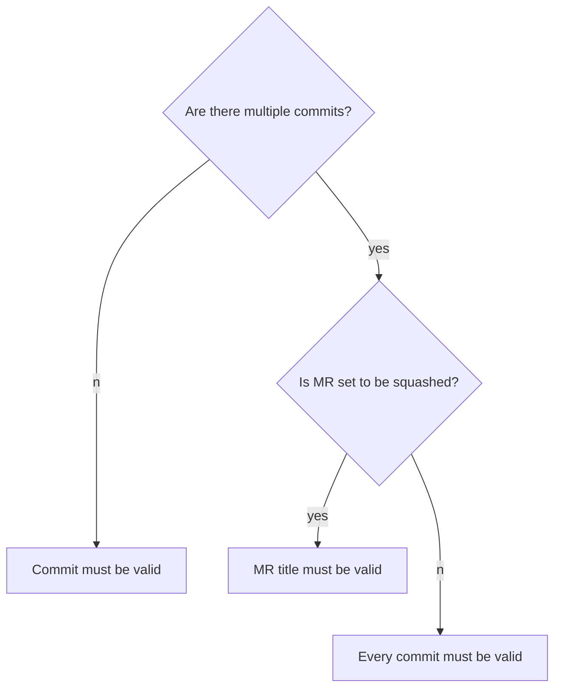

# Commit conventions

We use conventional commits specifications to write meaningful commit messages. We rely on this standard when we generate changelog.

Please read the official specifications for more details: [https://www.conventionalcommits.org/](https://www.conventionalcommits.org/).

Each commit message consists of a **header**, a **body**, and a **footer**. The header has a special
format that includes a **type**, a **scope**, and a **subject**:

```plaintext
<type>(<scope>): <subject>
<BLANK LINE>
<body>
<BLANK LINE>
<footer>
```

The header is mandatory, and the scope of the header is optional.
Each line in the commit message should be no longer than 72 characters.

We use the following logic to lint your MR's commit messages:



Following these conventions results in a clear [changelog](../../CHANGELOG.md) for every version.

## When should my MR's title follow these conventions?

It's generally a good idea to follow the conventions for your MR's title as well as for commit messages. This way, if your merge request is squashed
upon merge, the maintainer can use its title as the final commit message, creating a properly-formatted history.

## Is it okay that all my commits don't follow the conventions in a single MR?

If your MR contains multiple commits but only one logical change, you can enable the [Squash commits when merge request is accepted](https://docs.gitlab.com/user/project/merge_requests/squash_and_merge/) option (enabled by default). Then GitLab uses the MR title.

If your MR contains breaking changes, the commit message will need to be manually modified when using squash commits, to ensure the `BREAKING CHANGE:` trailer persists.

## What types can you use for commit messages?

We use the same types as [Angular's commit guidelines](https://github.com/angular/angular.js/blob/master/DEVELOPERS.md#type):

- **feat:** A new feature (adding a new component, providing new variants for an existing component, etc.).
- **fix:** A bug fix (correcting a styling issue, addressing a bug in a component's API, etc.).
  When updating non-dev dependencies, mark your changes with the `fix:` type.
- **docs:** Documentation-only changes.
- **style:** Changes that do not affect the meaning of the code
  (whitespace, formatting, missing semicolons, etc). _Not_ to be used for CSS changes as those are
  meaningful changes, consider using `feat:` of `fix:` instead.
- **refactor:** A code change that neither fixes a bug nor adds a feature.
- **perf:** A code change that improves performance.
- **test:** Adding missing tests or correcting existing tests.
- **build:** Changes that affect the build system (changing webpack or Rollup configuration for example).
- **ci:** Changes to our CI/CD configuration files and scripts
  (such as changing `.gitlab-ci.yml`, adding or changing Danger plugins).
- **chore:** Other changes that don't modify source or test files. Use this type when adding or
  updating dev dependencies.
- **revert:** Reverts a previous commit.

Each commit type can have an optional scope to specify the place of the commit change: `type(scope):`.
It is up to you to add or omit a commit's scope. When a commit affects a specific component, use the
component's PascalCase name as the commit's scope. For example:

```plaintext
feat(statusbar): automatically switch pipelines
```

If you're introducing a breaking change, start the message body with
[`BREAKING CHANGE:`](https://www.conventionalcommits.org/en/v1.0.0/#commit-message-with-description-and-breaking-change-footer).

## Commitizen

[Commitizen](https://commitizen.github.io/cz-cli/) is a CLI tool that provides an interactive interface to help you write commit messages following conventional commits specifications.
