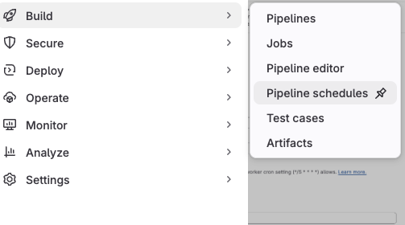
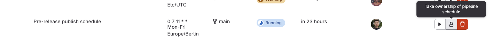
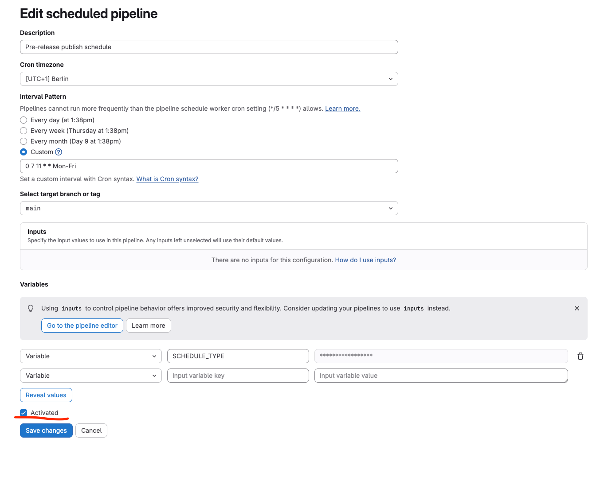

# Release process

This release process is concerned with releasing the GitLab Workflow extension to the **desktop** VS Code (Microsoft marketplace and Open-VSX).
If you are interested to release the extension to GitLab WebIDE, follow the [WebIDE release process](https://gitlab.com/gitlab-org/gitlab-web-ide/-/blob/main/docs/contributing/development-environment-setup.md#updating-gitlab-vscode-extension-project).

We release semi-regularly, aiming for at least two releases per GitLab Self-Managed release. A Release DRI (Directly Responsible Individual) is in charge of ensuring regular releases per milestone.

## Cadence

The main purpose of the cadence is to minimize delays before releasing useful features and fixes to users. Cadences also provide predictability, and a reduction in the time spent organizing and performing ad-hoc releases.

### Main releases - two per milestone

The rules for determining release dates are:

1. **End-of-milestone release:**
   - Occurs two business days before the first _candidate_ commit for each monthly self-managed release.
     - This ensures there is sufficient time to update the extension in the Web IDE, if necessary.
     - The candidate commit is created [one week before the self-managed release date](https://handbook.gitlab.com/handbook/engineering/releases/#self-managed-releases-process) dates.
     - GitLab Self-Managed release dates are defined here: [https://about.gitlab.com/releases/](https://about.gitlab.com/releases/).
   - This always falls on a Tuesday around the middle of the month.
1. **Mid-milestone release:**
   - Occurs halfway between end-of-milestone releases.
   - Most milestones are 4 weeks long so this will generally fall on a Tuesday.
     - 2 weeks after the previous end-of-milestone release.
   - Some milestones are 5 weeks long. In this case, the 2nd release will occur on a Thursday.
     - 2 weeks and 2 days after the previous end-of-milestone release.

### Ad-hoc releases

Releases outside of the planned dates are still encouraged when there is a fix or user facing feature that will provide value to the users.

If there are multiple features/fixes, we try to release no more than once per week. This is because part of the release is a manual process.

If you are not a maintainer, ask the [Release DRI](#release-dri) or [one of the maintainers](https://gitlab-org.gitlab.io/gitlab-roulette/?currentProject=gitlab-vscode-extension&mode=show&hidden=reviewer) to release the extension.

### Pre-Release

We regularly publish [pre-release](https://code.visualstudio.com/api/working-with-extensions/publishing-extension#prerelease-extensions) version of GitLab extension to be able to better dogfood our work and spot any issues early on, and also allow users opt-in into more often updates to get new features faster.

`publish-pre-release::scheduled` job runs regularly to provide nightly build stream.

We can also publish the pre-release version of the extension by manually running `publish-pre-release::manual` CI job. This job will take care of bumping the version, tagging, and crating a GitLab release.

#### Pre-Release management

In certain cases it may be desirable to prevent a scheduled pre-release, for instance if there's a major issue with `main` and a quick rollback is blocked for some reason.

To enable or disable automatic pre-releases follow this guide (you need to be at least a Maintainer in the project):

1. Go to Build -> [Pipeline Schedules](https://gitlab.com/gitlab-org/gitlab-vscode-extension/-/pipeline_schedules)<br>
   
1. Take ownership of the `Pre-release publish schedule`<br>
   
1. Edit the pipeline `Pre-release publish schedule` and check/Uncheck `Active` checkbox<br>
   

Check [Scheduled pipeline docs](https://docs.gitlab.com/ci/pipelines/schedules/) for more details.

## Release DRI

The Release DRI is a rotating position. The position exists to ensure the regular release dates are communicated, and that releases are performed necessary.

### Responsibilities

- Make sure you are aware who is the DRI for the current milestone.
- Make sure you have read the release schedule and if you will NOT be available on one of the dates, assign someone else.
- Communicate the planned dates ahead of time to the `#f_vscode_extension` Slack channel.
  - This is to give a heads-up to anyone who contributes to, or depends on, the extension. For example `group::editor extensions`, `group::ide`.
- On the date of the release, when you are ready to create the release:
  - Follow the [Perform release](#perform-release) steps.
  - Update the milestone release schedule with the required details.
  - [Update the extension within the Web IDE](https://gitlab.com/gitlab-org/gitlab-web-ide/-/blob/main/docs/contributing/development-environment-setup.md?ref_type=heads#updating-gitlab-vscode-extension-project).
- Determine a Release DRI 'shadow' who will take over for the next release, and ensure they are informed.

### How should we choose the DRI?

The Release DRI position will rotate through members of the extension's custodian group (`group::editor extensions`). Due to the requirement to perform a release, the Release DRI must be a [maintainer of the project](https://gitlab-org.gitlab.io/gitlab-roulette/?currentProject=gitlab-vscode-extension&mode=show&hidden=reviewer).

### Milestone release schedule

A release section is added to the `group::editor extensions` [milestone planning issues](https://gitlab.com/gitlab-org/editor-extensions/meta/-/issues/?label_name%5B%5D=Planning+Issue). This shows:

- The DRI (release officer).
- The release dates.

Example:

| Release Schedule |                 |                             |                                                                                                                                                         |
| ---------------- | --------------- | --------------------------- | ------------------------------------------------------------------------------------------------------------------------------------------------------- |
| **Date**         | **Release DRI** | **Status**                  | **Comments**                                                                                                                                            |
| 23 May 2024      | `@tristan.read` | Skipped :x:                 | No updates                                                                                                                                              |
| 11 June 2024     | `@tristan.read` | Released :white_check_mark: | [Marketplace version 4.10.0](https://marketplace.visualstudio.com/_apis/public/gallery/publishers/GitLab/vsextensions/gitlab-workflow/4.10.0/vspackage) |

## Perform release

### Note community contributors

> <span style="color: black; background-color: orange"> ⚠️ **WARNING!** ⚠️</span> This step is not automated yet, we need to add missing community contributors highligts manually. Ideally we should do it as a part of the original community contributor MR.

1. Get emails of all contributors between the tag you just created and one before:

   ```shell
   git log --format='%ae' $(git describe --abbrev=0 --tags HEAD^)..HEAD | sort -u
   ```

1. In the result, look for emails that don't end with `@gitlab.com`.
1. Manually add attribution to the `CHANGELOG.md`, for each contribution from community contributor to the latest release entry. For example:

   ```plaintext
   (Implemented|Fixed) by [@flood4life](https://gitlab.com/flood4life) with [MR !90](https://gitlab.com/gitlab-org/gitlab-vscode-extension/-/merge_requests/90) 👍
   ```

1. If that's their first contribution, add the contributor to `CONTRIBUTORS.md`.
1. Commit the changes `git add CHANGELOG.md CONTRIBUTORS.md && git commit -m "chore: add contributors to CHANGELOG"`.
1. Wait until the new pipeline passes

### Run the release job

1. Make sure there's no main pre-release happening right now. Check in `#f_vscode_extension` Slack channel for details.
1. Anounce the release is about to be published in `#f_vscode_extension`
1. Open a main branch pipeline on a commit you want to publish as a release. This commit has to be after any previous release commits.
1. Locate `publish-release::manual` job and start it. The version update, tagging, and creating the GitLab release will happen automatically.
1. Add a message to our `#f_vscode_extension` Slack channel (replace `3.0.0` with the released version):

   ```plaintext
   :vscode:  [GitLab Workflow](https://marketplace.visualstudio.com/items?itemName=gitlab.gitlab-workflow) `3.0.0` has been released :rocket:
   See [CHANGELOG.md](https://gitlab.com/gitlab-org/gitlab-vscode-extension/-/blob/main/CHANGELOG.md).
   ```

1. Update the [Release section](#milestone-release-schedule) in the `group::editor extensions` current [milestone planning issue](https://gitlab.com/gitlab-org/editor-extensions/meta/-/issues/?label_name%5B%5D=Planning+Issue).
1. If this is a [Regular release](#main-releases---two-per-milestone), open an MR to [update GitLab Workflow in the GitLab Web IDE project](https://gitlab.com/gitlab-org/gitlab-web-ide/-/blob/main/docs/contributing/development-environment-setup.md?ref_type=heads#updating-gitlab-vscode-extension-project) to the new version.
   - Before sending the MR to review, perform a smoke test of Workflow features (e.g. Code Suggestions, GitLab Duo Chat).

## Rollback

You released a critical issue and you need to return to a working version. Don't panic.

Since all published extensions are stored on external marketplaces/services we need to roll forward in order to rollback. That means, we revert the problematic commit in the main branch and run new `publish-release::manual` job

1. Revert problematic commit and get it to main branch (usually via a normal process with MR and reviews). Make sure the commit message contains a _release-triggering_ commit message (starting with `fix`, `feat`, etc.)
1. Make sure there's no main release happening right now. Check in `#f_vscode_extension` Slack channel for details.
1. Anounce the pre-release rollback is about to be published in `#f_vscode_extension`
1. Open a main branch pipeline on the commit you'be just merged
1. Locate `publish-release::manual` job and start it.
1. Once it's done, anounce the publishing was succesful in `#f_vscode_extension`

## Publish pre-release manually

### Perform pre-release

1. Make sure there's no main release happening right now. Check in `#f_vscode_extension` Slack channel for details.
1. Anounce the pre-release is about to be published in `#f_vscode_extension`
1. Open a main branch pipeline on a commit you want to publish as a pre-release
1. Locate `publish-pre-release::manual` job and start it. The version update, tagging, and creating the GitLab release will happen automatically.
1. Once it's done, anounce the publishing was succesful in `#f_vscode_extension`

### Rollback pre-release

Since all published extensions are stored on external marketplaces/services we need to roll forward in order to rollback. That means, we revert the problematic commit in the main branch and run new `publish-pre-release::manual` job

1. Revert problematic commit and get it to main branch (usually via a normal process with MR and reviews). Make sure the commit message contains a _release-triggering_ commit message (starting with `fix`, `feat`, etc.)
1. Make sure there's no main release happening right now. Check in `#f_vscode_extension` Slack channel for details.
1. Anounce the pre-release rollback is about to be published in `#f_vscode_extension`
1. Open a main branch pipeline on the commit you'be just merged
1. Locate `publish-pre-release::manual` job and start it.
1. Once it's done, anounce the publishing was succesful in `#f_vscode_extension`

## Access tokens for Marketplaces

_This section applies once a year when the Microsoft VS Code Marketplace token automatically expires._

Our [CI/CD jobs](https://gitlab.com/gitlab-org/gitlab-vscode-extension/blob/e80e5798dbac5944ebaa52dc0dc2cb861509588e/.gitlab-ci.yml#L110-124) use the access tokens for publishing packaged extension to market places.

### How to generate tokens

#### Open VSX

1. Log in to [GitHub.com](https://github.com/) with `GitHub vscode account`
   credentials from the "VS Code Extension" 1Password Vault.
1. Log in to [open-vsx.org](https://open-vsx.org/) with the GitHub account.
1. Go to the [Access Tokens Settings page](https://open-vsx.org/user-settings/tokens).
1. Create a new token.
1. **Open VSX tokens don't expire.**

#### Microsoft VS Code Marketplace

1. Sign in to [Microsoft Azure](https://azure.microsoft.com/) with `VScode Marketplace`
   credentials from the "VS Code Extension" 1Password Vault.
1. Go to [**Personal access tokens**](https://dev.azure.com/GitLabEditorExtensions/_usersSettings/tokens).
   ([Official VS Code publishing documentation](https://code.visualstudio.com/api/working-with-extensions/publishing-extension#get-a-personal-access-token)).
1. You can either:
   - Extend the expiration date of an existing token. **This solution is the best one when you receive token expiration email.**
   - Generate a new token. Assign it the least privileges possible - it probably only
     needs **Marketplace - publish**.

### Release automation with Semantic Release

We use [semantic-release](https://github.com/semantic-release/semantic-release) plugin to automate the release process.

Semantic release offers a number of plugins that allow us to automate various steps of the release process.

| Plugin                                                                                                     | Description                                                                                                                                        |
| ---------------------------------------------------------------------------------------------------------- | -------------------------------------------------------------------------------------------------------------------------------------------------- |
| [`@semantic-release/commit-analyzer`](https://github.com/semantic-release/commit-analyzer)                 | analyses commits since the last release to identify which version bump to apply (patch, minor or major)                                            |
| [`@semantic-release/release-notes-generator`](https://github.com/semantic-release/release-notes-generator) | generates release notes based on the commit messages                                                                                               |
| [`@semantic-release/npm`](https://github.com/semantic-release/npm)                                         | writes the npm version. Can also be used to publish the package to an npm registry                                                                 |
| [`@semantic-release/git`](https://github.com/semantic-release/git)                                         | commits file changes made during the release and pushes them to the repository                                                                     |
| [`@semantic-release/gitlab`](https://github.com/semantic-release/gitlab)                                   | creates a GitLab release and uploades related release artifacts, such as the extension file                                                        |
| [`@semantic-release/exec`](https://github.com/semantic-release/exec)                                       | allowes to run integrate custom scripts into semantic-release lifecycle. We use it to package an extension and later publish it to various sources |
