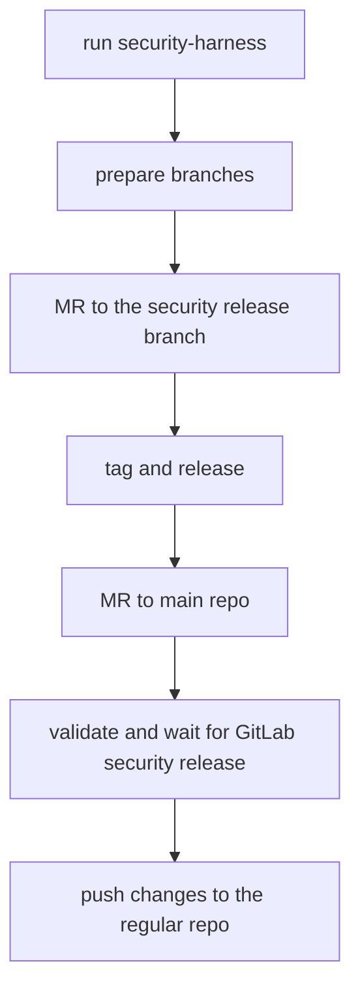

# Security Releases

This guide is based on the main [`gitlab-org/gitlab` security release process](https://gitlab.com/gitlab-org/release/docs/-/tree/master/general/security)

## DO NOT PUSH TO `gitlab-org/gitlab-vscode-extension`

As a developer working on a fix for a security vulnerability, your main concern is not disclosing the vulnerability or the fix before we're ready to publicly disclose it.

To that end, you'll need to be sure that security vulnerabilities are fixed in the [Security Repo](https://gitlab.com/gitlab-org/security/gitlab-vscode-extension).

This is fundamental to our security release process because the [Security Repo](https://gitlab.com/gitlab-org/security/gitlab-vscode-extension) is not publicly-accessible.

## Process

A security fix starts with an issue identifying the vulnerability. In this case, it should be a confidential issue on the `gitlab-org/gitlab-vscode-extension` project on [GitLab.com](https://gitlab.com/)

Once a security issue is assigned to a developer, we follow the same merge request and code review process as any other change, but on the [Security Repo](https://gitlab.com/gitlab-org/security/gitlab-vscode-extension).

### Schema



### Preparation

Before starting, add the new `security` remote on your local GitLab repository:

```shell
git remote add security git@gitlab.com:gitlab-org/security/gitlab-vscode-extension.git
```

Finally, run the `scripts/security-harness` script. This script will install a Git `pre-push` hook that will prevent pushing to any remote besides `gitlab.com/gitlab-org/security`, in order to prevent accidental disclosure.

Please make sure the output of running `scripts/security-harness` is:

```shell
Security harness installed -- you will only be able to push to gitlab.com/gitlab-org/security!
```

### Request CVE number

For exploitable security issues, request a CVE number by [creating an issue in `gitlab-org/cves` project](https://gitlab.com/gitlab-org/cves/-/issues/new). **You can do the release before the CVE number is available.** When the CVE number is assigned, add it to the [changelog entry](https://gitlab.com/gitlab-org/gitlab-vscode-extension/-/blob/main/CHANGELOG.md#security).

Example CVE request: [https://gitlab.com/gitlab-org/cves/-/issues/21](https://gitlab.com/gitlab-org/cves/-/issues/21)

### Branches

The main objective is to release the security fix as a patch of the latest production release and backporting this fix on `main`.

#### Patch release branch

1. Check the [extension version in the marketplace](https://marketplace.visualstudio.com/items?itemName=gitlab.gitlab-workflow).
1. In the `gitlab-vscode-extension`, find the marketplace version tag by checking the [tags](https://gitlab.com/gitlab-org/security/gitlab-vscode-extension/-/tags).
1. In the `gitlab-vscode-extension`, [create a security branch](https://gitlab.com/gitlab-org/security/gitlab-vscode-extension/-/branches/new) based on the latest released tag.
   For example, if the latest released tag is `v.2.2.0`, create a branch in the security project with:
   - **Branch name:** `security-v2.2.0`
   - **Create from:** `v2.2.0`.

#### Security fix branch

Your fix is going to be pushed into `security-<issue number>` branch. If you work on issue #9999, you push the fix into `security-9999` branch.

```shell
git fetch security
git checkout security-v2.2.0
git checkout -b security-9999
git push security security-9999
```

### Development

Here, the process diverges from the [`gitlab-org/gitlab` security release process](https://gitlab.com/gitlab-org/release/docs/-/tree/master/general/security).

1. **Before developing the fix, make sure that you've already run the `scripts/security-harness` script.**
1. Implement the fix and push it to your branch (`security-9999` for issue #9999).
1. Create an MR to merge `security-9999` to the patch release branch (`security-v2.2.0`) and get it reviewed.
1. Merge the fix (make sure you squash all the MR commits into one).

### Release the change

Follow the [regular release process](release-process.md) to tag a new patch version on the `security-v2.2.0` branch and release it. Patch release for tag `v2.2.0` would have version and tag `v2.2.1`. Push the new version commit (changing `CHANGELOG.md` and version in `package.json`) to the `security-v2.2.0` branch.

Validate that the security issue is fixed in production.

### Backport the fix to the extension repository

To backport the fix to the [extension repository](https://gitlab.com/gitlab-org/gitlab-vscode-extension):

1. [Create an MR](https://gitlab.com/gitlab-org/security/gitlab-vscode-extension/-/merge_requests/new?merge_request%5Bsource_project_id%5D=18897919&merge_request%5Bsource_branch%5D=&merge_request%5Btarget_project_id%5D=5261717&merge_request%5Btarget_branch%5D=main) from the security project:
   - **Source project:** `gitlab-org/security/gitlab-vscode-extension`
   - **Source branch:** The patch release branch (for example `security-v2.2.0`)
   - **Target project:** `gitlab-org/gitlab-vscode-extension`
   - **Target branch:** `main`
1. Merge the MR. No review is necessary since the changes have already been
   reviewed.
