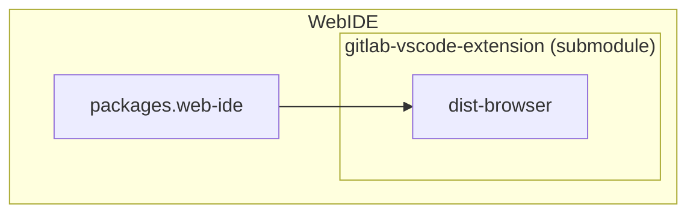
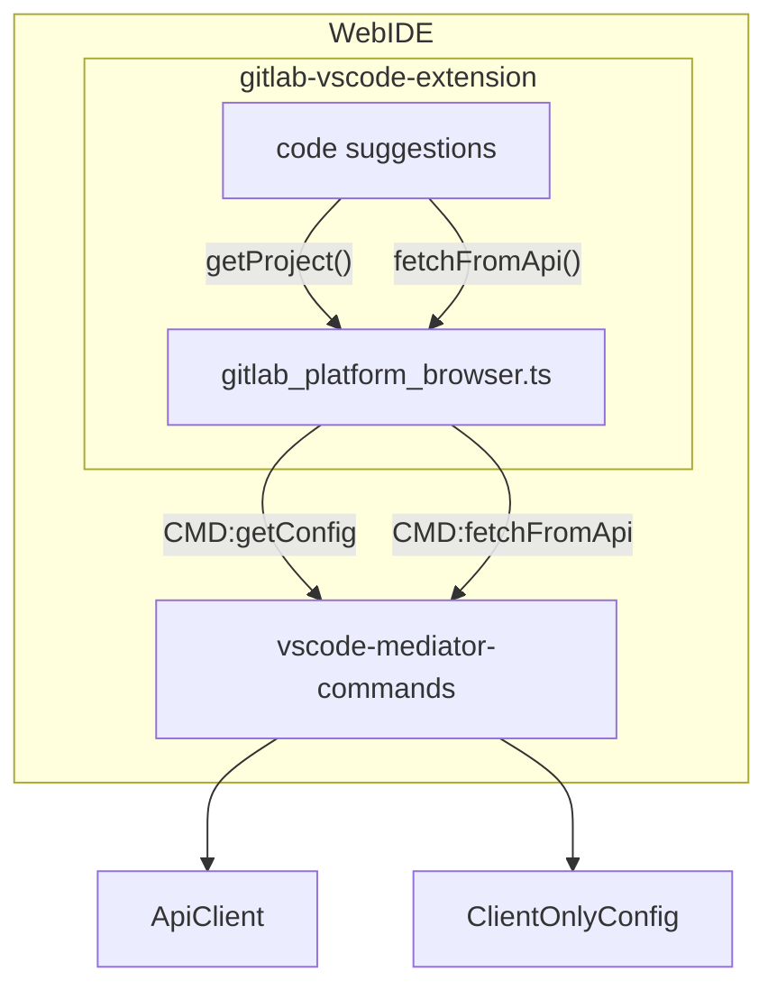

# WebIDE interoperability

As the [Architecture](architecture.md) document explains, this extension can run in the browser in WebIDE.

This document explains how we package the extension WebIDE and how the browser `GitLabPlatformForActiveProject` implements calling GitLab API and getting the project context.

## Diagrams

### Compile-time

This diagram shows how the extension gets included in the final WebIDE bundle. The GitLab app then depends on this bundle to show the WebIDE.

We build and package the extension in the WebIDE project using `make`. WebIDE calls `npm build:browser` script in this repository and copies the resulting `dist-browser` folder as the extension folder into WebIDE.

### Runtime

This diagram shows how the extension runs in WebIDE when the WebIDE starts in the browser.

The Workflow extension needs access to two objects out of the VS Code runtime:

- `ApiClient` that can make API requests to GitLab (it uses the already-authenticated browser context (a cookie))
- `ClientOnlyConfig` - WebIDE gets this config from Rails, and it contains information about the context in which WebIDE started (e.g. project, branch, MR)

The extension gets access to these two objects through mediator commands.

The `gitlab_platform_browser.ts` then uses these mediator commands to implement the `GitLabPlatformForActiveProject` interface.
