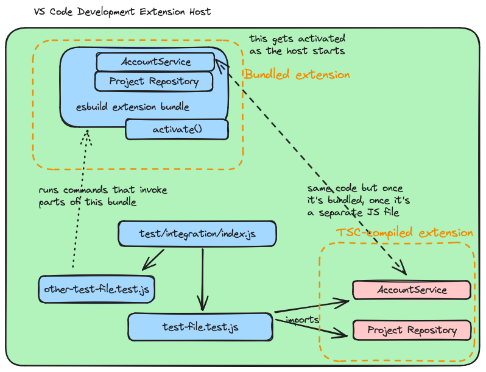

# Writing tests

This document provides technical details about our automated tests. Read the [Testing strategy](testing-strategy.md) document to understand why we test this way.

## Technology choice

- **Unit Tests**: TypeScript and [Jest](https://jestjs.io/). To learn more, read [Replace mocha with jest for unit testing](https://gitlab.com/gitlab-org/gitlab-vscode-extension/-/merge_requests/87).
- **Integration tests**: JavaScript and [`mocha`](https://mochajs.org/) as a test runner, [`assert`](https://nodejs.org/docs/latest-v12.x/api/assert.html) for assertions, and [`vscode-test`](https://code.visualstudio.com/api/working-with-extensions/testing-extension#the-test-script) to run integration tests in VS Code instance

_We choose JavaScript for integration tests because `@types/jest` and `@types/mocha` are not compatible and often cause conflicts. The integration tests are written against much more stable VS Code Extension API and so some of the TS benefits are not as pronounced._

## Unit tests `npm run test:unit`

Place unit tests for a module in the same folder as the production code. The name of the test file has `.test.ts` suffix.

- `src/desktop/git/git_remote_parser.ts` - production file
- `src/desktop/git/git_remote_parser.test.ts` - test file

You can debug unit tests by running the "Unit Tests" [Launch configuration](https://code.visualstudio.com/docs/editor/debugging#_launch-configurations).

You should use the [Jest VS Code extension](https://marketplace.visualstudio.com/items?itemName=Orta.vscode-jest).

### Mocking complicated objects

[`createFakePartial`](https://gitlab.com/gitlab-org/gitlab-vscode-extension/blob/5097e3663de17bde1be5d7eb9d769010817794ba/src/common/test_utils/create_fake_partial.ts#L21) helps you create an object that satisfies the target object's type (passed to the generic). It helps you mock objects when you don't need all the properties of an object for the test:

```typescript
const error = new FetchError(
  createFakePartial<Response>({
    ok: false,
    url: 'https://example.com/api/v4/project',
    status: 400,
  }),
  'resource name',
  `{ "error": "invalid_grant" }`,
);
```

[Source](https://gitlab.com/gitlab-org/gitlab-vscode-extension/blob/5097e3663de17bde1be5d7eb9d769010817794ba/src/common/errors/fetch_error.test.ts#L20-28)

### Singletons

We use singletons initialized during module initialization:

```typescript
export const accountService: AccountService = new AccountService();
```

[Source](https://gitlab.com/gitlab-org/gitlab-vscode-extension/blob/5097e3663de17bde1be5d7eb9d769010817794ba/src/desktop/accounts/account_service.ts#L260)

Our implementation refers to these singletons directly, like this:

```typescript
import { accountService } from '../accounts/account_service';
//.. some code
const accounts = accountService.getAllAccounts();
```

[Source](https://gitlab.com/gitlab-org/gitlab-vscode-extension/blob/5097e3663de17bde1be5d7eb9d769010817794ba/src/desktop/commands/validate_accounts.ts#L65)

This direct reference (as shown above) is an issue. The reason: no clean way exists for unit tests to inject the singleton dependency into the tested unit.

We solve this issue with two different approaches:

1. Mocking the full module:

   ```typescript
   jest.mock('../accounts/account_service', () => ({
     accountService: {
       getAllAccounts: jest.fn().mockImplementation(() => [account]),
     },
   }));
   ```

   - [Source](https://gitlab.com/gitlab-org/gitlab-vscode-extension/blob/669d848b9d5b0ffa016256f1e219dfa6e3ecb854/src/desktop/gitlab/gitlab_platform_desktop.test.ts#L17-21)

1. Replacing properties of the singleton:

   ```typescript
   accountService.getAllAccounts = () => mockedAccounts;
   ```

   - [Source](https://gitlab.com/gitlab-org/gitlab-vscode-extension/blob/669d848b9d5b0ffa016256f1e219dfa6e3ecb854/src/desktop/commands/validate_accounts.test.ts#L20)

We are considering introducing Dependency Injection and removing all the singletons. See [refactor: solve initialisation issues with Dependency injection](https://gitlab.com/gitlab-org/gitlab-vscode-extension/-/merge_requests/1507).

### `vscode` global mock

When the extension host process starts your extension, it injects a `vscode` global object into the runtime. This `vsocde` object gives you access to the [VS Code Extension API](https://code.visualstudio.com/api/references/vscode-api). This API gives you control over the VS Code editor.

The catch: Jest doesn't start the VS Code editor, so the `vscode` runtime dependency is not available. We use the [Jest module mocking feature](https://jestjs.io/docs/manual-mocks#mocking-user-modules) and have our [`src/__mocks__/vscode.js` global mock](https://gitlab.com/gitlab-org/gitlab-vscode-extension/blob/5097e3663de17bde1be5d7eb9d769010817794ba/src/__mocks__/vscode.js#L1).

Sometimes, when your feature depends on an API that we've never used, the mocks are missing in the `vscode.js` global mock.

We considered using the [`streetsidesoftware/jest-mock-vscode`: VS Code Mock for jest](https://github.com/streetsidesoftware/jest-mock-vscode/tree/main), but it's not an active project and the mocked implementations don't have tests.

### Webview unit tests

We have extra tests for the webviews (separate Vue applications).

- Vue 3 webviews (`webviews/vue3`) use `vitest`
- Vue 2 webviews (`webviews/vue2`) use Jest

## Integration tests `npm run test-integration`

Integration tests mock the GitLab API using the [`msw`](https://mswjs.io/docs/) module. All API calls made by the extension are intercepted by `msw` and handled by [`mock_server.js`](https://gitlab.com/gitlab-org/gitlab-vscode-extension/-/blob/main/test/integration/test_infrastructure/mock_server.js?ref_type=heads).

A temporary workspace for integration tests is created once before running the test suite by `scripts/create_test_workspace.ts`. In this helper script, we use [`simple-git`](https://github.com/steveukx/git-js) module to initialize Git repository.

## Two environments for integration tests

> [!note]
> This section can be confusing. Read it carefully.

We use `esbuild` to bundle all production code into one file `out/extension.js`. This file **is** the extension. That works great for production, but it's a _nightmare_ for integration testing.

When we load the extension in integration tests, we load this `extension.js` bundle. Because it's all in one file, we can't import parts of our application and change them.

Before the `esbuild` bundling, we could call `accountService.addAccount();` from our integration tests, and we would add the account to the extension under test. This approach is no longer the case because the `accountService` is bundled in the large bundle, and we can't import it in the tests.

We solve this by initializing a _second_ extension for tests, running some tests on the bundled extension, and some tests on the second extension. The benefit of testing the bundled extension: it's as close to the production as we get. The benefit of the second extension: we can manipulate the extension internals for white-box testing.



- The "Bundled Extension" is running from the `esbuild` bundled file - this one simulates the real production extension, but because it's bundled, we can't access the internal modules
  - You can tell these tests because they don't `import` any modules from the extension (like the [`create_snippet_test.js`](https://gitlab.com/gitlab-org/gitlab-vscode-extension/blob/5097e3663de17bde1be5d7eb9d769010817794ba/test/integration/create_snippet.test.js#L1-54))
- The "`tsc` compiled extension" is running the `tsc` compiled files - Here we can require modules and singletons like `accountService` in the tests.
  - We use almost exclusively this `tsc` version. Because here we have access to the extension internals.

### Debugging integration tests

We can debug the integration tests by running the "Integration Tests" [Launch configuration](https://code.visualstudio.com/docs/editor/debugging#_launch-configurations).

### Create a new integration test

When creating a new integration test, you must know how the tested functionality interacts with:

- The rest of the VS Code.
- The file system.
- The GitLab API.

Read the [integration strategy](testing-strategy.md#extension-under-integration-tests) to understand the test boundaries.

#### Prepare VS Code dependency

We are now not mocking any part of VS Code. You should be able to set the extension up by calling the [VS Code extension API](https://code.visualstudio.com/api). You might be able to use some of our services directly to set up the extension. Example is setting up the test token by running `accountService.addAccount();`

#### Prepare file system dependency

If you need an additional `git` configuration for your testing, you can set it up either in `scripts/create_test_workspace.ts` (if all tests need it). Or you can use `simple-git` directly in your test set up code (don't forget to reset the configuration after your test to prevent side effects).

You can find example of setting the Git repository in a test in [`insert_snippet.test.js`](https://gitlab.com/gitlab-org/gitlab-vscode-extension/-/blob/main/test/integration/insert_snippet.test.js):

```javascript
it('throws an error when it cannot find GitLab project', async () => {
  const git = simpleGit(getRepositoryRoot());
  await git.removeRemote(REMOTE.NAME);
  await git.addRemote(REMOTE.NAME, 'git@test.gitlab.com:gitlab-org/nonexistent.git');
  await assert.rejects(insertSnippet(), /Project gitlab-org\/nonexistent was not found./);
});
```

#### Prepare GitLab API dependency

We use [`msw`](https://mswjs.io/docs/) to intercept any requests and return prepared mock responses. When you want to add a new mocked response, do it in the following steps:

1. Use a debugger to inspect what request you send out from `gitlab_service.ts`.
1. Run your tests and note down the logged request that the functionality under test makes.
1. Mock the request in the `before` or `beforeEach` method in your test.

## E2E tests `npm run test:e2e`

We use [`wdio-vscode-service`](https://www.npmjs.com/package/wdio-vscode-service) to test in a VS Code Desktop IDE with our `.vsix` packaged extension installed. This allows us to access the VS Code API from our tests.

Place e2e tests in `test/e2e/specs`. The name of the test file has `.e2e.js` suffix.

To run and debug e2e tests locally, see [`test/e2e/README.md`](../../test/e2e/README.md).

> [!note]
> If changes were made, you must repackage the extension.
